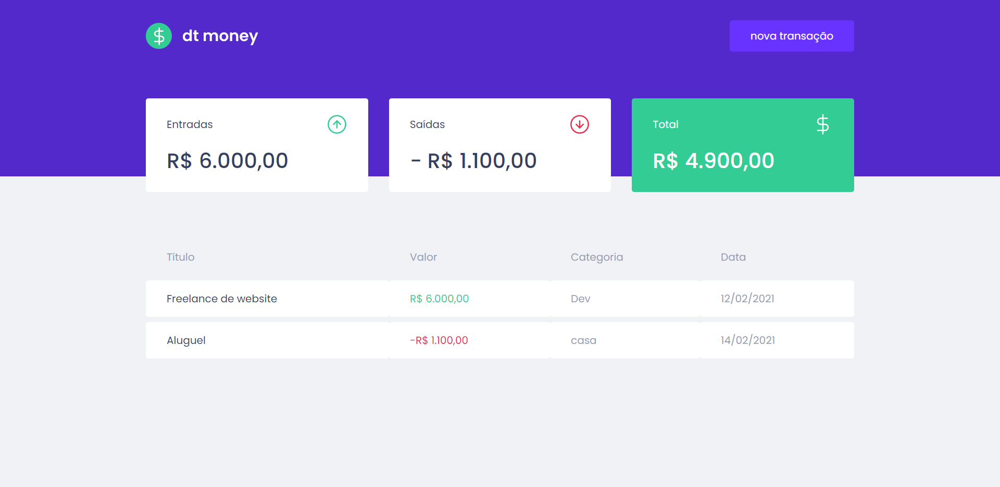

# :rocket: dt money

O dt money é uma aplicação web feita para gerenciar suas finanças, permitindo o cadastro de entradas, saídas e a organização das mesmas em categorias.

<p align="center">
  
</p>

## :crystal_ball: Tecnologias

Tecnologias e ferramentas utilizadas no desenvolvimento do projeto:

- [React](https://reactjs.org/)
- [TypeScript](https://www.typescriptlang.org/)
- [Styled Components](https://styled-components.com/)
- [MirageJS](https://miragejs.com/)
- [Axios](https://github.com/axios/axios)
- [Polished](https://polished.js.org/)

<br>

## :arrow_forward: Instalação e uso

```bash
# Abra um terminal e copie este repositório com o comando
git clone https://github.com/evertonvargas/dtmoney
# ou use a opção de download.

# Entre na pasta web com
cd dtmoney

# Instale as dependências
npm i

# Rode a aplicação
npm start

# O server estará rodando em http://localhost:3000
```
